[options="header"]
[cols="1, 3, 3"]
|===
|Version | Bearbeitungsdatum   | Autor 
|1.0	| 09.05.2022 | Thomas Berthold
|1.1	| 16.05.2022 | Robert Peter
|1.2	| 15.07.2022 | Duc Hieu Le, Thomas Berthold
|===

:Projektname: MHMPS
:Firmenname: Möbel-Hier
:toc: left
:numbered:

== Entwicklerdokumentation

== Einführung und Ziele

Die Möbel-Hunger-Kette möchte das frisch erworbene Unternehmen {Firmenname} mit einer Software für Bestellverwaltung, Lagerhaltung und Auslieferung ausstatten. Diese trägt den Arbeitstitel {Projektname}.

Kunden (_customer_) können aus einem Katalog (_catalogue_) einzelne Möbel (_piece of furniture_) oder Möbel-Kombinationen aus Einzelmöbeln oder Möbelteilen (_bundles_) wählen. Ihre Bestellungen werden am Telefon von einem Mitarbeiter (_employee_) entgegengenommen und in der Bestellverwaltung (_orders_) abgelegt. Für die zügige Belieferung der Kunden unterhält {Firmenname} ein Lager (_warehouse_), das ebenfalls durch {Projektname} verwaltet werden soll. Für die Auslieferung (_delivery_) kann der Kunde zwischen Selbstabholung mit eigenem oder von {Firmenname} geliehenem LKW (_truck_) oder Anlieferung durch {Firmenname} wählen. Für die Geschäftsführung (_manager_) soll ein Überblick (_overview_) über die Möbelverkäufe einzelner Lieferanten (_vendor_) im monatlichen Vergleich erstellt werden.

{Projektname} soll somit den Kunden eine gut strukturierte und angenehm präsentierte Auswahl an Möbeln anbieten. Für die Mitarbeiter ist eine übersichtliche, schnell zu bedienende Arbeitsumgebung wichtig, die Geschäftsführung hingegen benötigt im Wesentlichen einige übersichtliche Zusammenfassungen.

<<<

=== Qualitätsziele
Die folgenden Qualitätsanforderungen sollen von {Projektname} erfüllt werden:

Anpassbarkeit::
{Projektname} soll leicht an geänderte Bedingungen angepasst werden können.

Bedienkomfort::
Dem Kunden soll ein angenehmes, umsatzsteigerndes Einkaufserlebnis, den Mitarbeitern und der Geschäftsführung ein leicht zu bedienendes, übersichtliches Set an Tools geboten werden.

Sicherheit::
Sämtliche Daten müssen vor Diebstahl und missbräuchlicher Verwendung geschützt werden.

Stabilität::
{Projektname} sollte rund um die Uhr stabil laufen.

In der folgenden Tabelle wird die Wichtigkeit der Ziele angegeben.
1 = unwichtig ..
5 = sehr wichtig

[options="header", cols="3h, ^1, ^1, ^1, ^1, ^1"]
|===
|Quality Demand           | 1 | 2 | 3 | 4 | 5
|Anpassbarkeit            |   |   | x |   |
|Bedienkomfort            |   |   |   | x |
|Sicherheit               |   |   |   |   | x 
|Stabilität               |   |   |   |   | x 
|===
<<<
== Randbedingungen

=== Hardware-Vorgaben
* Server
* internetfähiges Endgerät

=== Software-Vorgaben
* Java 11 (oder höher)
* moderner Browser

=== Vorgaben zum Betrieb der Software

{Projektname} soll interessierten Kunden rund um die Uhr einen Katalog mit den Angeboten von {Firmenname} bieten. Diese benötigen einen Browser, um auf den Server zugreifen zu können, und minimale Grundkenntnisse in Web-Navigation.

Für die Mitarbeiter von {Firmenname} ist {Projektname} das wichtigste Arbeitswerkzeug. Während Kunden anrufen, um Bestellungen aufzugeben, zu ändern oder sich über den aktuellen Status zu informieren, nutzen die Mitarbeiter die angebotenen Tools, um die Kundenwünsche im System zu speichern, Verfügbarkeiten zu prüfen und zu ändern, ggfs. Produkte nachzuordern.

Die Geschäftsführung ist mit {Projektname} jederzeit und ohne technische Kenntnisse in der Lage, sich einen Überblick über die aktuelle Geschäftsentwicklung zu verschaffen und diese mit den Vormonaten zu vergleichen. Dabei gibt es auch die Möglichkeit, dem Programm von {Firmenname} neue Lieferanten hinzuzufügen oder bisherige Lieferanten zu entfernen.

<<<

== Kontextabgrenzung

Das Kontextdiagramm zeigt das geplante Software-System in seiner Umgebung. Zur Umgebung gehören alle Nutzergruppen des Systems und Nachbarsysteme.

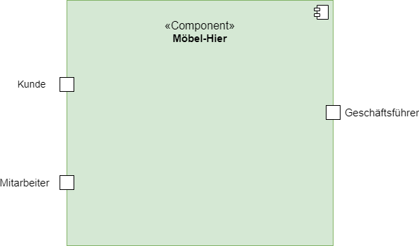
<<<
=== Top-Level-Architektur
Top-Level-Architektur mit Hilfe eines Komponentendiagramms.

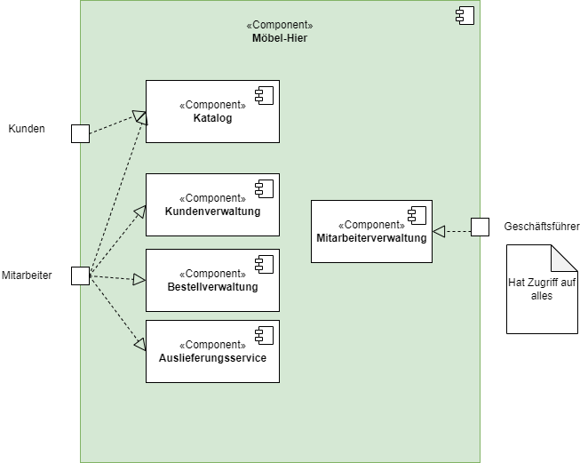
<<<
== Lösungsstrategie
=== Erfüllung der Qualitätsziele

[options="header"]

|=== 
|Qualitätsziel |Lösungsansatz
|Anpassungsfähigkeit a|
* *modularer Aufbau* - Änderungen eines Moduls haben möglichst wenige Effekt auf andere Module.
* *gute Dokumentation* - eine nachvollziehbare Dokumentation ermöglicht das Verständnis der Anwendung und ihrer Zusammenhänge.
* *Wiederverwendbarkeit* - die Komponenten der Software können auch für andere Zwecke wieder verwendet werden.
|Bedienkomfort a|
* *intuitive Bedienbarkeit* - Tooltips, klare Struktur, eindeutige Beschriftungen.
* *Ästhetik* - angenehmes Design.
* *Zugänglichkeit* - Nutzer sollen von verschiedensten Endgeräten auf den Katalog zugreifen können.
* *Fehlerbehandlung* - Fehlbedienungen sollen nicht zu Systemabstürzen führen und dem Nutzer ein Feedback über die Ursache des Fehlers geben.
|Sicherheit a|
* *Passwortschutz* - Zugriff auf die Mitarbeiter- und Geschäftsführungsfunktionen nur durch Authentifizierung.
* *Zurechenbarkeit* - Nachverfolgung von Zugriffen, damit Fehler oder Missbrauch zurück verfolgt werden können.
* *Integrität* - keine unauthorisierte Veränderung von Daten.
|Stabilität a|
* *Testen* - umfangreiches Testen vor und während des Betriebs
|===
<<<
=== Software-Architektur

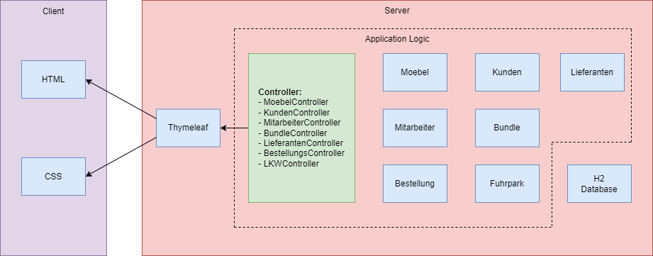

_Client-Server-Modell der Anwendung. Der Client erhält nur HTML- und CSS-Dateien. Die Logik findet auf der Serverseite statt._

<<<

== Entwurfsentscheidungen
=== Verwendete Muster

* *Spring MVC*

=== Persistenz
* *Hibernate*

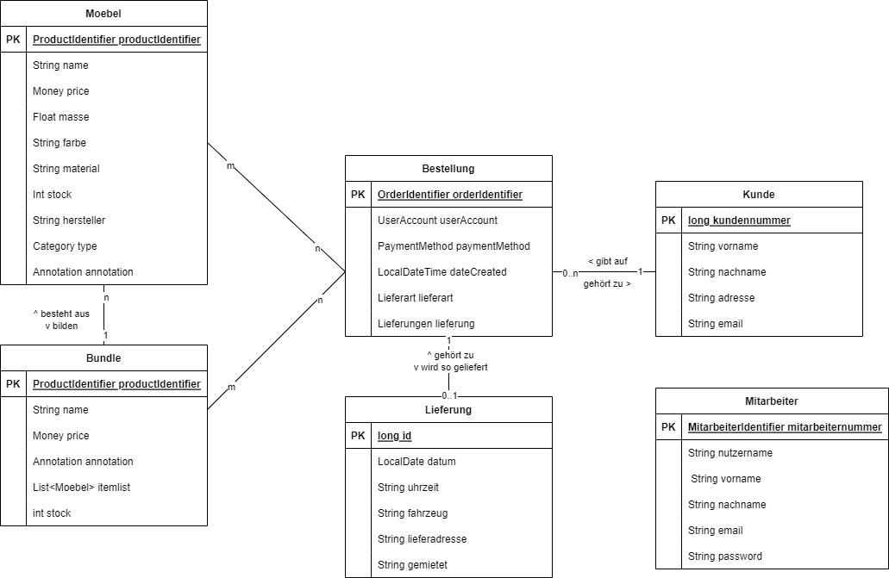
<<<

=== Benutzeroberfläche

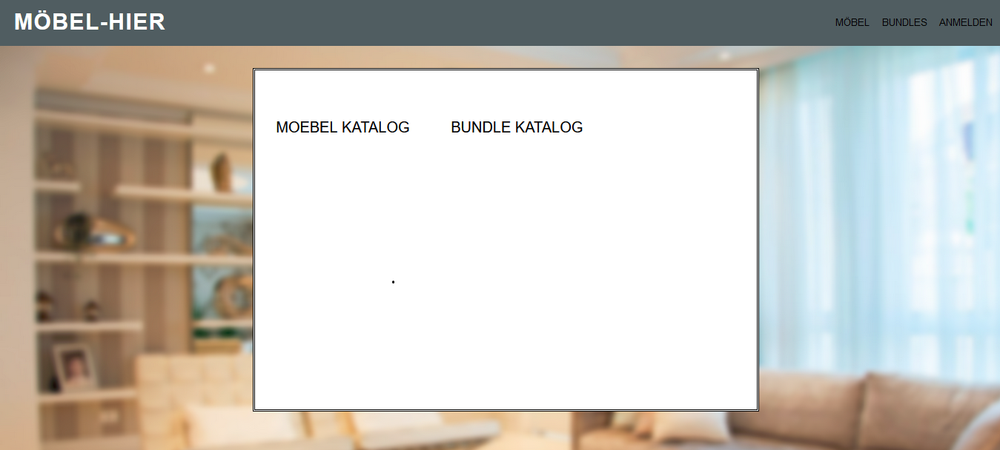

durch Klick auf Moebel -bzw. Bundle-Katalog erreicht man die Kataloge

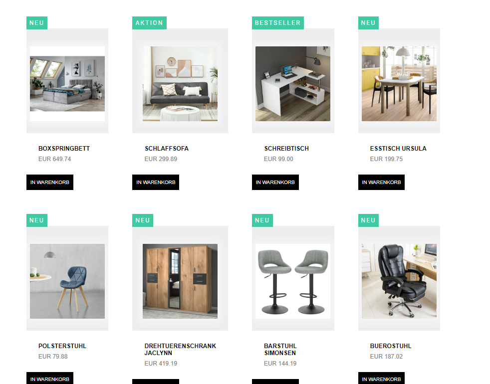

<<<

über den Login erreicht man die Login-Seite für Mitarbeiter und Geschäftsführer

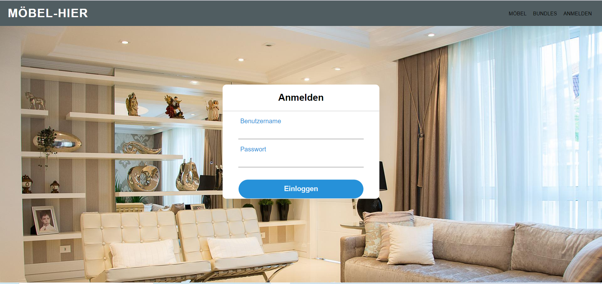

Danach hat man Zugriff auf die Mitarbeiter-Funktionen, als Boss zudem auf die Mitarbeiterverwaltung

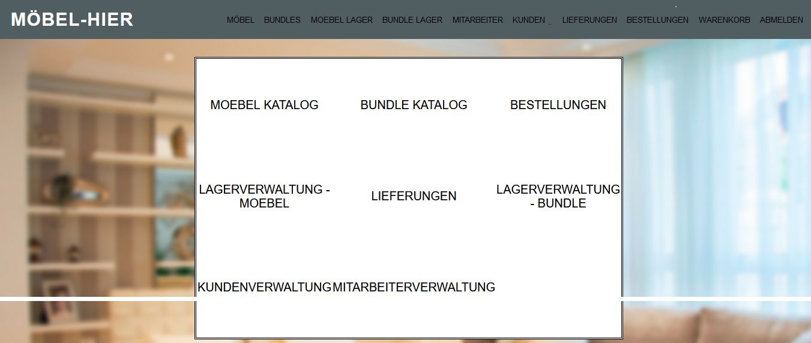

<<<

Über "Katalog" und "Bundles" erreicht man den Katalog wie auch von der Startseite. Die anderen Buttons führen zu den entsprechenden Überblicksseiten (hier beispielhaft Lieferungen und Mitarbeiter)

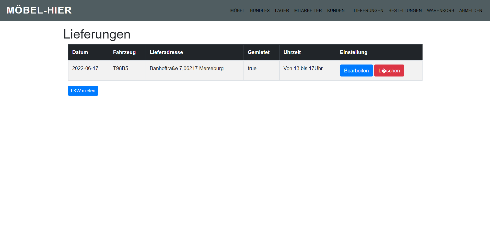

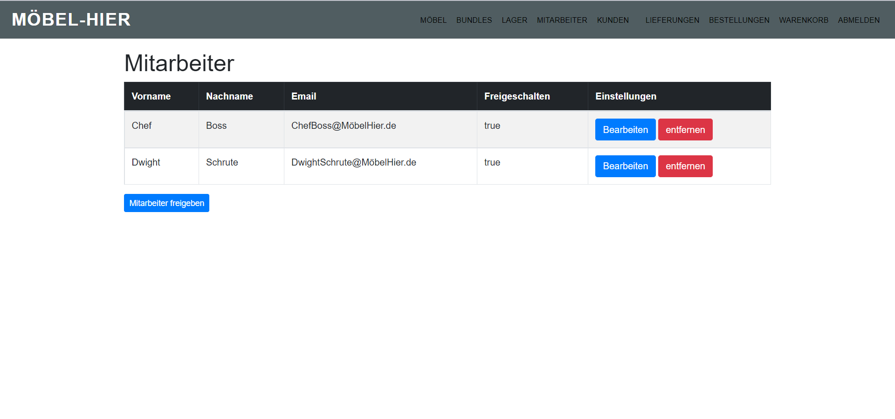

<<<

Alle Überblicksseiten bieten über "Bearbeiten" Zugriff auf ein Bearbeitungsformular, hier beispielhaft das Formular für die Mitarbeiterbearbeitung

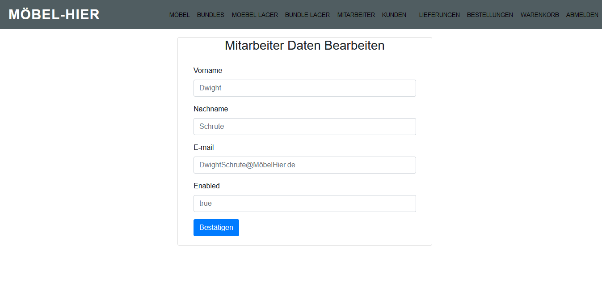

Über die oben durchlaufende Navigationsleiste kann man alle Seiten erreichen.

<<<

=== Verwendung externer Frameworks

[options="header", cols="1,2"]
|===
|Externes Package 
|Verwendet von (Klasse der eigenen Anwendung)

|salespointframework.catalog
|	Bestellung.bestellungsController +
	Moebel.bundle +
	Moebel.moebel +
	Moebel.Initializer

|salespointframework.core
|	Bestellung.bestellungsController +
	Moebel.bundle +
	Kunde.kunde +
	Kunde.kundenInitializer +
	Moebel.Initializer

|salespointframework.inventory
|	Moebel.Controller

|salespointframework.order
|	Bestellung.bestellungsController

|salespointframework.payment
|	Bestellung.bestellungsController

|salespointframework.quantity
|	Bestellung.bestellungsController

|salespointframework.userAccount
|	Bestellung.bestelungsController +
	Kunde.kunde +
	Kunde.kundenManagement +
	Kunde.kundenRepository

|springframework.data
|	Kunde.kundenManagement +
	Kunde.kundenRepository +
	Moebel.warenkatalog

|springframework.stereotype
|	Bestellung.bestellungsController +
	Kunde.kundenController +
	Kunde.kundenInitializer +
	Kunde.kundenManagement +
	Moebel.moebelController

|springframework.transaction
|	Kunde.kundenManagement

|springframework.ui
|	Bestellung.bestellungsController +
	Kunde.kundenController +
	Moebel.moebelController

|springframework.util
|	Bestellung.bestellungsController +
	Kunde.kundenController +
	Kunde.kundenInitializer +
	Kunde.kundenManagement +
	Moebel.moebelInitializer

|springframework.validation
|	Kunde.kundenController +
	Kunde.kundenForm 

|springframework.web
|	Bestellung.bestellungsController +
	Kunde.kundenController +
	Moebel.moebelController

|===

<<<

== Bausteinsicht
* Entwurfsklassendiagramme der einzelnen Packages

=== Mitarbeiter

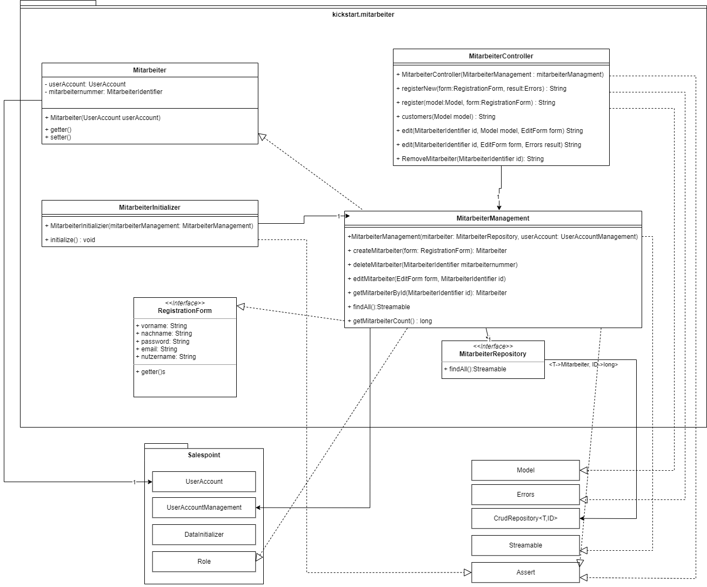

[options="header"]
|=== 
|Klasse/Enumeration |Beschreibung
|Mitarbeiter|Eine Klasse zur Definition von Mitarbeitern, die Klasse UserAccount wird um einen Wert erweitert.
|MitarbeiterInitializer |Eine Initializer-Klasse zum Anlegen ersten Mitarbeiterdaten
|RegistrationForm |Ein Interface zur Übermittelung und Verarbeitung von Kundendaten
|MitarbeiterRepository |Ein Interface zur Bereitstellung von Funktionen zur Datenbankmanipulation
|MitarbeiterController |Eine Klasse zum Beantworten von HTML-Anfragen zu den Mitarbeitern
|MitarbeiterManagement |Eine Klasse zum Anlegen und Anzeigen von Mitarbeiterdaten 
|===

=== Kunden

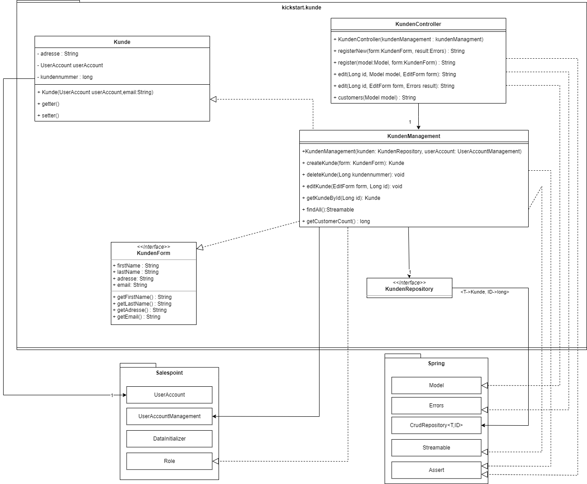

[options="header"]
|=== 
|Klasse/Enumeration |Beschreibungg
|Kunde|Eine Klasse zur Definition von Kunden, die Klasse UserAccount wird mit Parametern und Funktionen erweitert
|KundenInitializer |Eine Klasse um zum Start der Anwendung erste Kundendaten zu speichern
|KundenController |Eine Controller-Klasse zum Anlegen und Anzeigen von Kundendaten
|KundenManagement |Eine  Klasse zur Datenbankmanipulation und zum suchen in dieser
|KundenRepository |Ein Interface zur Bereitstellung von Funktionen für die Datenbankmanipulation
|KundenForm |Ein Interface zur Übermittlung und Verarbeitung von Kundendaten
|===

=== Möbel

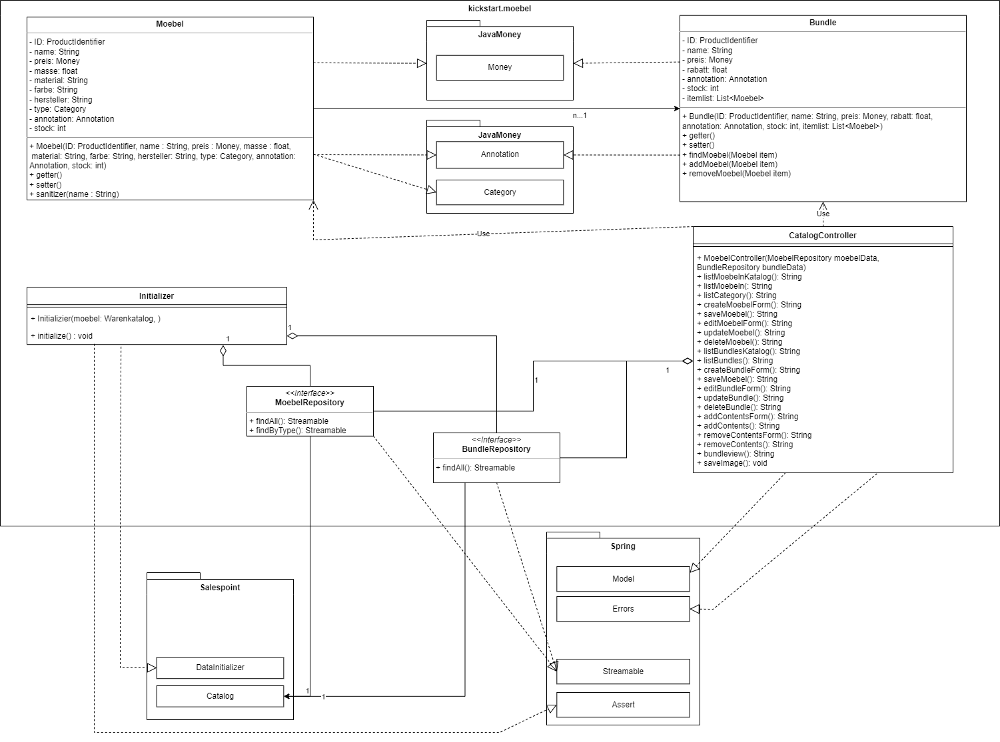

[options="header"]
|=== 
|Klasse/Enumeration |Beschreibung
|Moebel|Eine Klasse zur Definition der Möbeldaten. Es ist eine Erweiterung der Product-Klasse
|Bundle|Eine Klasse zur Definition der Bundledaten. Es ist eine Erweiterung der Product-Klasse
|Controller |Ein Spring-Controller zum Anzeigen von Möbeldaten und Bundledaten
|MoebelManagement |Eine Klasse zur Verarbeitung von Aufgaben der Möbels/Bundlespeicherung und -verwaltung
|Initializer |Eine Klasse zur Speicherung erster Möbel, beim Start der Anwendun
|MoebelRepository |Ein Repository-Interface zur Datenbankmanipulation
|Warenkatalog |Ein Interface zur Erstellung eines Katalogs
|===

=== Bestellung

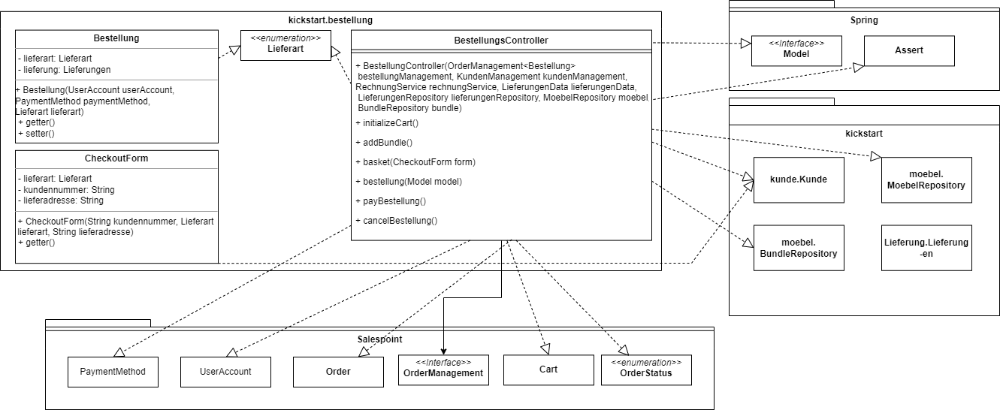

[options="header"]
|=== 
|Klasse/Enumeration |Beschreibung
|BestellungsController|Ein Spring MVC Controller, um Bestellungen zu starten, Produkte hinzuzufügen und die Bestellung zu speichern.
|===

=== Rückverfolgbarkeit zwischen Analyse- und Entwurfsmodell
_Die folgende Tabelle zeigt die Rückverfolgbarkeit zwischen Entwurfs- und Analysemodell. Falls eine Klasse aus einem externen Framework im Entwurfsmodell eine Klasse des Analysemodells ersetzt,
wird die Art der Verwendung dieser externen Klasse in der Spalte *Art der Verwendung* mithilfe der folgenden Begriffe definiert:_

* Inheritance/Interface-Implementation
* Class Attribute
* Method Parameter

[options="header"]
|===
|Klasse/Enumeration (Analysemodell) |Klasse/Enumeration (Entwurfsmodell) |Art der Verwendung
|Kunde |Kunde extends salespoint.UserAccount|
|- |KundenController |Klassenattribut
|- |KundenManagement |Klassenattribut
|- |KundenRepositiry |Interface
|- |KundenForm		 |Interface
|- |KundenInitializer|
|Mitarbeiter |Mitarbeiter extends salespoint.UserAccount |
|- |MitarbeiterController |Klassenattribut
|- |MitarbeiterManagement |Klassenattribut
|- |MitarbeiterRepository |Interface
|- |RegistrationForm 	  |Interface
|- |MitarbeiterInitializer|
|Möbel(komponente) |Moebel extends salespoint.Product|
|Möbel-Bundle |Bundle |
|- |moebel.Controller |Klassenattribut
|- |moebel.Management |Klassenattribut
|- |moebel.Initializer|
|- |MoebelRepository  |Interface
|- |Warenkatalog	  |Interface
|Bestellung |salespoint.Order |
|- |BestellungsController |Klassenattribut
|Lieferant |lieferung.Lieferant |
|LKW |lieferung.LKW |
|- |lieferung.Lieferung |
|- |lieferung.Controller |KlassenAttribut
|- |lieferung.Management |KlassenAttribut
|- |LieferRepositry 	 |Interface
|- |LieferForm			 |Interface
|===

== Laufzeitsicht
* Darstellung der Komponenteninteraktion anhand eines Sequenzdiagramms, welches die relevantesten Interaktionen darstellt.

=== Bestellung

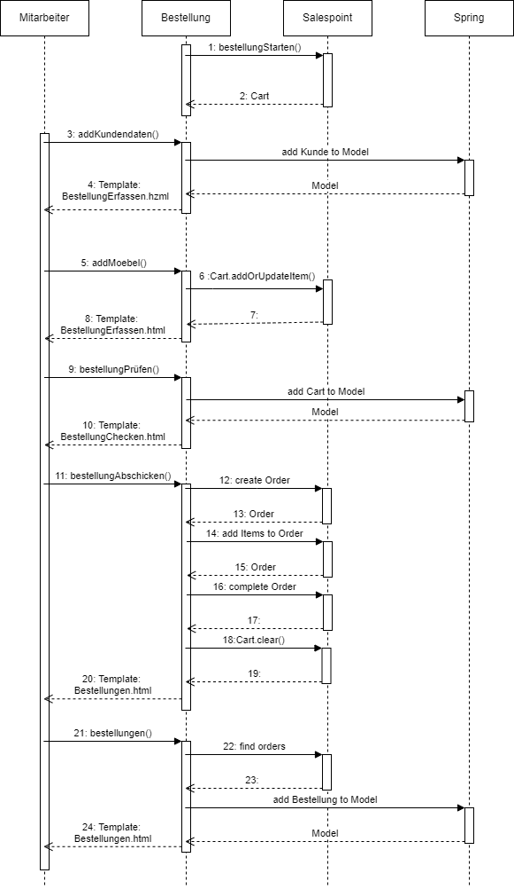

=== Inventar

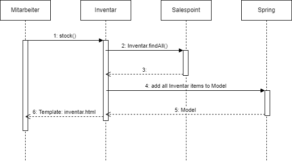

=== Kunden

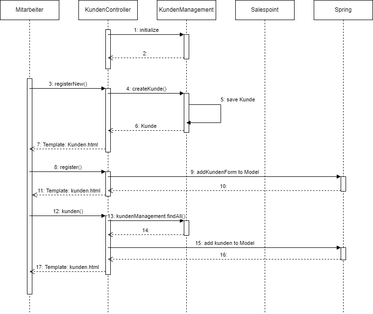

== Technische Schulden
- Muss-Anforderungen 160, 170, 180 und 230 nicht erfüllt
- Akzeptanztests lediglich manuell durchgeführt

