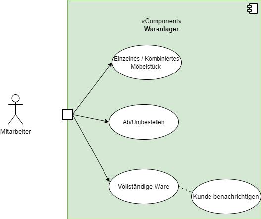
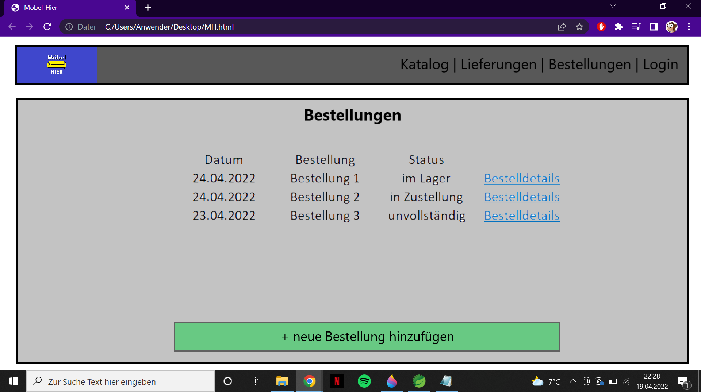

= Pflichtenheft
:project_name: Webanwendung Möbel-Hier
:toc: macro
:toc-title:

== __{project_name}__

[options="header"]
[cols="1, 1, 1, 1, 4"]
|===
|Version | Status      | Bearbeitungsdatum   | Autoren(en) |  Vermerk
|0.1     | Abgeschlossen   | 01.04.2022          | Autor       | Initiale Version
|1.0     | Abgeschlossen   | 25.04.2022          | Gruppe 3       | Abgabe-Version
|1.1     | in Bearbeitung  | 05.05.2022          | Gruppe 3       | Verbesserung der Abgabe-Version
|===

<<<

== Inhaltsverzeichnis
toc::[]

== Zusammenfassung
Dieses Dokument trägt die Softwareanforderungen für eine Webanwendung eines Möbelhändlers zusammen und erstellt eine Analyse der Anwendungsfälle und Komponenten. Zudem werden die Tests, die eine erfolgreiche Implementierung prüfen, angegeben. Dies dient der Einigung auf eine angestrebte Version, mit der Stakeholder (in diesem Fall Professor Karol) und Entwickler (in diesem Fall Studenten der Gruppe 3) jeweils zufrieden sind. Dieses Dokument beschreibt funktionale und nicht funktionale Anforderungen und wie diese umgesetzt werden sollen. Sollten im Laufe des Semesters Anpassungen der Anforderungen gemacht werden, dann müssen diese ebenfalls dokumentiert werden.

== Aufgabenstellung und Zielsetzung

Das von der Möbel-Hunger-Kette übernommene Geschäft Möbel-Hier wird von Ihnen mit einer neuen Kundensoftware ausgestattet. Im Leistungsumfang sind die Bestellverwaltung, das Warenlager und der Auslieferungsservice enthalten. Besonderes Augenmerk soll auf die Warenbestellung, -zwischenlagerung und -auslieferung gelegt werden. Den Kunden liegt ein Sortiment im Internet vor, aus dem sie telefonisch Möbel bestellen können. Die Lieferung erfolgt entweder in das Hauptlager oder direkt an den Kunden. Für ersteres muss der Kunde bei vollständiger Ware automatisch benachrichtigt werden, damit er sie abholen kommen kann. Weiterhin soll eine Statusabfrage über die bereits gelieferten Möbelteile der Bestellungen möglich sein. Wenn der Kunde unbedingt will, kann er die bereits gelieferte Ware in Teilen abholen, muss dann aber auch diese Teile sofort bezahlen.
Ein Grundsatz des Möbelhauses heißt Modularität. Der Kunde kann sich die meisten Möbelstücke einzeln bestellen, jedoch auch vorgefertigte Sätze, so z.B. eine Couchecke mit Ein-, Zwei- und Dreisitzer. Variabilität ist beispielsweise über die Farbe oder den Bezug möglich. Einige Möbelstücke können allerdings nur in Kombination mit anderen bestellt werden. Ein Couchtisch besteht beispielsweise aus Gestell und Platte, wobei es von beiden Komponenten mehrere Ausfertigungen gibt.
Die Auslieferung erfolgt mit dem firmeneigenen LKW-Park. Alternativ können sich Kunden zum Abtransport der Ware diese LKW's mieten. Je nach Gewicht der Lieferung soll immer der nächst günstigere LKW vermietet bzw. von der Firma genutzt werden. Mit Bestellung der Ware (und auch später) soll der Kunde die Möglichkeit haben, einen LKW für die Abholung zu mieten.
Die Software soll auch die Ab- und Umbestellung der Ware berücksichtigen. Je nach Bearbeitungsstand einer Lieferung errechnet sich eine Rücklieferungs- und Bearbeitungsgebühr. Die Stornierung einer LKW-Rückgabe bleibt solange kostenlos, wie der LKW zu der eigentlich vermieteten Zeit entweder von der Firma genutzt oder erneut vermietet werden kann. Andernfalls muss der Kunde eine Stornierungsgebühr von 20% bezahlen.
Das Angebotsspektrum von Möbel-Hier ergibt sich aus den Katalogen der angegliederten Großlieferanten, wobei auf Wunsch aber auch Produkte ausgeblendet werden können. Die Geschäftsbeziehungen zu diesen Firmen soll entsprechend verwaltet werden. Die Preiskalkulation für die Waren findet gruppiert nach den Großlieferanten statt, so ergeben bspw. die Kundenpreise der Waren des Lieferanten Großmöbel 205% des Lieferpreises.
Um die Attraktivität des Angebotes steigern zu können, möchte die Geschäftsführung von Möbel-Hier eine monatliche Abrechnung (mit Vergleich zum Vormonat) haben, in der die Möbelverkäufe nach Großlieferanten aufgegliedert aufgeführt sind. Basierend auf diesen Analysen möchte Möbel-Hier Lieferanten aus dem Programm nehmen und neue einfügen können.

== Produktnutzung

Das Produkt dieser Arbeit soll eine Webanwendung sein, welche Mitarbeitern die Möglichkeit gibt, Waren, welche von der Firma vertrieben werden, anzuzeigen. Mitarbeiter sollen in der Lage sein, mit dieser Webanwendung Bestellungen von Kunden anzunehmen und Lieferungen zu buchen und auch ab- und umzubuchen. Die Geschäftsführung soll dazu noch die Möglichkeit haben, die Großlieferanten zu vergleichen und beruhend auf diesen Vergleichen Lieferanten aus dem Angebot zu nehmen oder wieder hinzuzufügen.

== Interessensgruppen (Stakeholders)
[cols="1, 1, 1, 4"]
|===
|Name | Priorität (1-5)   | Beschreibung |  Primäres Ziel

|Geschäftsführung Möbel-Hier
| 5   
|der Abnehmer des Projektes.
a|
- Überblick über Geschäftsentwicklung
- Vergleich verschiedener Lieferanten
- Steigerung der Produktivität der Mitarbeiter

|Mitarbeiter Möbel-Hier     
| 4   
| Nutzer.
a|
- effiziente Bearbeitung von Bestellungen
- Verwaltung Lager und Fuhrpark

|Gruppe 3     
| 3
| Studenten, die das Projekt implementieren.        
a|
- Implementierung einer funktionierenden Webanwendung

|Administratoren
| 3   
| Softwarebetreuer Möbel-Hier
a|
- Wartung und Fehlerbehebung im laufenden Betrieb

|===

<<<

== Systemgrenze und Top-Level-Architektur

=== Kontextdiagramm
Das Kontextdiagramm zeigt das geplante Software-System in seiner Umgebung. Zur Umgebung gehören alle Nutzergruppen des Systems und Nachbarsysteme.

image::./models/analysis/Context-Diagram.png[Kontext Diagram]
<<<
=== Top-Level-Architektur
Top-Level-Architektur mit Hilfe eines Komponentendiagramms.

image::./models/analysis/Toplevel-Architektur.png[Katalog]

<<<

== Anwendungsfälle

=== Anwendungsdiagramme  

==== Bestellung machen

==== Bestellstatus anfragen

<<<
==== Bestellung modifizieren

<<<
==== Bestellung stornieren

<<<
==== Möbel zurückgeben

<<<
=== Akteure

Akteure sind die Benutzer des Software-Systems oder Nachbarsysteme, welche darauf zugreifen. Diese Tabelle gibt einen Überblick über die Akteure und beschreibt sie kurz. 

[options="header"]
[cols="1,1"]
|===
|Name |Beschreibung
|Kunde  |Kunden können nur den Katalog anschauen und müssen einen Mitarbeiter anrufen, um zu bestellen.	 
|Mitarbeiter  |Mitarbeiter können die Anliegen der Kunden bearbeiten, Bestellungen und Lieferungen aufgeben, modifizieren und stornieren, sowie das  Warenlager verwalten.
|Geschäftsführer  |Zusätzlich zu dem, was Mitarbeiter tun können, kann der Geschäftsführer auch die detaillierte Kaufstatistik sehen und Lieferanten einfügen oder entfernen.
|===

<<<

=== Überblick Anwendungsfalldiagramm
Anwendungsfall-Diagramme, die alle Anwendungsfälle und alle Akteure darstellen

=== Katalog

<<<
=== Analyse

<<<
=== Bestellverwaltung

<<<
=== Auslieferungsservice

<<<
=== Warenlager

<<<
=== Kundenverwaltung

<<<
=== Mitarbeiterverwaltung

<<<
=== Anwendungsfallbeschreibungen
Dieser Unterabschnitt beschreibt die wesentlichen Anwendungsfälle.

[cols="1h,3"]
[[UC0010]]

|===
|ID                         |**<<UC0010>>**
|Name                       | Login/Logout
|Description                |Geschäftsführer soll sich im System authentifizieren können, um exklusive Funktionen benutzen zu können.
Dies soll über das Ausloggen rückgängig gemacht werden können.
|Actors                     |Geschäftsführer
|Trigger                    a|
Login: Geschäftsführer möchte exklusive Funktionen benutzen
Logout: Geschäftsführer möchte Funktionen nicht weiter nutzen 
|Precondition(s)           a|
- Login: Benutzer ist nicht als Geschäftsführer im System authentifiziert 
- Logout: Geschäftsführer ist im System nicht authentifiziert 
|Essential Steps           a|
Login:

1. Geschäftsführer wählt "Login" in der Navigationsleiste  
2. Geschäftsführer gibt Authentifikationsdaten an
3. Geschäftführer wählt "einloggen"

Logout:

1. Geschäftsführer wählt "ausloggen"  
2. Geschäftführer wird vom System als Mitarbeiter behandelt und der Homescreen wird aufgerufen 
|Extensions                 |-
|Functional Requirements    | <<F0010>>
|===

[cols="1h,3"]
[[UC0000]]

|===
|ID                         |**<<UC0000>>**
|Name                       |Katalog aufrufen
|Description                |Mitarbeiter muss die Artikel im Sortiment einsehen können.
|Actors                     |Mitarbeiter
|Trigger                    |Navigationselement, welches den Katalog anzeigt, wird ausgewählt
|Precondition(s)           a|Keine
|Essential Steps           a|
1.  Mitarbeiter klickt auf das Navigationselement "Katalog"
2.  Mitarbeiter bekommt alle Artikel aufgelistet
|Extensions                 |-
|Functional Requirements    | 
|===

[cols="1h,3"]
[[UC0050]]

|===
|ID                         |**<<UC0050>>**
|Name                       |Ware bestellen
|Description                |Ware soll für den Kunden von den Lieferanten bestellt werden können
|Actors                     |Mitarbeiter
|Trigger                    |Kunde
|Precondition(s)           a|
- Kunde hat sich für ein oder mehr Artikel entschieden
|Essential Steps           a|
1.  Mitarbeiter fügt Artikel der Bestellliste hinzu 
2.  Mitarbeiter wählt "Bestellen"
|Extensions                 |-
|Functional Requirements    | <<F0050>>, <<F0070>>, 
|===

[cols="1h,3"]
[[UC0040]]

|===
|ID                         |**<<UC0040>>**
|Name                       |Ware filtern
|Description                | Mitarbeiter sollen die Anzahl der angezeigten Artikel in der Katalogansicht nach bestimmten Attributen eingrenzen könnnen
|Actors                     |Mitarbeiter
|Trigger                    |Mitarbeiter möchte die Artikelübersicht eingrenzen
|Precondition(s)           a|
- Mitarbeiter sieht sich den Katalog an (<<UC0000>>)
|Essential Steps           a|
1. Mitarbeiter wählt "Filter" 
2. Mitarbeiter wählt Attribute nach denen die Artikel gefiltert werden sollen
3. Mitarbeiter bekommt Artikel angezeigt die den gewählten Eigenschaften entsprechen 
|Extensions                 |-
|Functional Requirements    | <<F0040>>
|===

[cols="1h,3"]
[[UC0090]]

|===
|ID                         |**<<UC0090>>**
|Name                       |Ware hinzufügen/entfernen
|Description                |Mitarbeiter sollen die Möglichkeit haben, dem Katalog neue Artikel hinzuzufügen und Artikel aus dem Katalog zu entfernen
|Actors                     |Mitarbeiter
|Trigger                    |Mitarbeiter möchte Artikel aus dem Katalog entfernen oder einen neuen hinzufügen.
|Precondition(s)           a|
- Mitarbeiter sieht sich den Katalog an (<<UC0000>>)
|Essential Steps           a|
Artikel hinzufügen:

1.  Mitarbeiter wählt Artikel hinzufugen
2.  Mitarbeiter gibt Details zum neuen Artikel an 
3.  Hinzufügen des neuen Artikel wird bestätigt

Artikel entfernen:

1.  Mitarbeiter wählt Artikel entfernen
2.  Mitarbeiter wählt die zu entfernenden Artikel aus
3.  Auswahl wird bestätigt 
|Extensions                 |-
|Functional Requirements    | <<F0090>>
|===

[cols="1h,3"]
[[UC0120]]

|===
|ID                         |**<<UC0120>>**
|Name                       |Bestellung aufrufen
|Description                |Mitarbeiter sollen die Möglichkeit haben, Details von individuellen Bestellungen aufzurufen
|Actors                     |Mitarbeiter
|Trigger                    |Mitarbeiter möchte eine Bestellung im Detail ansehen
|Precondition(s)           a|
Keine
|Essential Steps           a|
1.  Mitarbeiter wählt "Bestellungen" in der Navigationsleiste
2.  Mitarbeiter gibt Bestellnummer oder Kundennamen in die Suchleiste ein
3.  Mitarbeiter wählt ein Suchergebnis
4.  Mitarbeiter bekommt Seite mit den Details der Bestellung angezeigt
|Extensions                 |-
|Functional Requirements    | <<F0110>>, <<F0120>>
|===

[cols="1h,3"]
[[UC0121]]

|===
|ID                         |**<<UC0121>>**
|Name                       |Bestellung bearbeiten
|Description                |Mitarbeiter sollen Bestellungen nachträglich bearbeiten können
|Actors                     |Mitarbeiter
|Trigger                    |Kunde möchte Änderung an seiner Bestellung vornehmen
|Precondition(s)           a|
Keine
|Essential Steps           a|
1.  Mitarbeiter hat die relevante Bestellung aufgerufen (<<UC0120>>)
2.  Mitarbeiter wählt "bearbeiten" für eine Bestellung
3.  Mitarbeiter kann nun Bestellungsdetails bearbeiten
|Extensions                 |-
|Functional Requirements    | <<F0120>>
|===

[cols="1h,3"]
[[UC0130]]

|===
|ID                         |**<<UC0130>>**
|Name                       |LKW mieten
|Description                | Am Ende des Bestellprozess soll ein LKW zur Auslieferung reserviert werden können.  
|Actors                     |Mitarbeiter
|Trigger                    |Kunde möchte am Ende des Bestellprozesses einen LKW mieten oder die Ware zugeliefert bekommen
|Precondition(s)           a|
- Mitarbeiter hat eine Bestellung aufgegeben (<<UC0050>>)
|Essential Steps           a|
Mitarbeiter wählt "LKW reservieren"
|Extensions                 |-
|Functional Requirements    | <<F0130>>
|===

[cols="1h,3"]
[[UC0131]]

|===
|ID                         |**<<UC0131>>**
|Name                       |LKW stornieren
|Description                |
|Actors                     |Mitarbeiter
|Trigger                    |Kunde möchte LKW Reservierung stornieren  
|Precondition(s)           a|
- Mitarbeiter ist auf der "Bestellung bearbeiten"-Seite (<<UC0121>>)
|Essential Steps           a|
Mitarbeiter wählt "LKW stornieren"
|Extensions                 |
Wenn Fahrzeug verwendbar ist:
 - Dem Kunden wird keine Bearbeitungsgebühr in Rechnung gestellt

Wenn Fahrzeug nicht verwendbar ist:
 - Dem Kunden wird eine Bearbeitungsgebühr von 20% des Mietpreises in Rechnung gestellt
|Functional Requirements    | <<F0130>>
|===

[cols="1h,3"]
[[UC0150]]

|===
|ID                         |**<<UC0150>>**
|Name                       |Abrechnung aufrufen
|Description                |Geschäftsführer soll eine Übersicht über die Finanzen des aktuellen Monats einsehen können
|Actors                     |Geschäftsführer
|Trigger                    |Geschäftsführer möchte Abrechnung einsehen
|Precondition(s)           a|
- Benutzer ist als Geschäftsführer im System authentifiziert  
|Essential Steps           a|
1.  Geschäftsführer wählt "Abrechnung" in der Navigationsleiste
2.  Geschäftsführer bekommt Abrechnung angezeigt  
|Extensions                 |-
|Functional Requirements    | <<F0150>>
|===

[cols="1h,3"]
[[UC0151]]

|===
|ID                         |**<<UC0151>>**
|Name                       |Abrechnung vergleichen
|Description                |Geschäftsführer soll Abrechnung des aktuellen Monats mit der Abrechnung des Vormonats vergleichen können
|Actors                     |Geschäftsführer
|Trigger                    |Geschäftsführer möchte Abrechnung dieses Monats mit Vormonat vergleichen
|Precondition(s)           a|
- Benutzer ist als Geschäftsfüherer im System authentifiziert
- Abrechnung wird angezeigt (<<UC0150>>)
|Essential Steps           a|
1. Geschäftsführer wählt "Abrechnung vergleichen" 
2. Aktuelle Abrechnung wird der Abrechnung des Vormonats gegenübergestellt
|Extensions                 |-
|Functional Requirements    | <<F0150>>
|===

[cols="1h,3"]
[[UC0140]]

|===
|ID                         |**<<UC0140>>**
|Name                       |Lieferanten einfügen/entfernen
|Description                |Lieferanten sollen hinzugefügt und entfernt werden können
|Actors                     |Mitarbeiter
|Trigger                    |Mitarbeiter möchte Lieferanten hinzufügen oder entfernen
|Precondition(s)           a|
Keine 
|Essential Steps           a|
Mitarbeiter hinzufügen:

1. Mitarbieter wählt "Lieferanten hinzufügen" aus der Navigationsleiste 
2. Lieferant wird im System gespeichert

Mitarbeiter entfernen:

1. Mitarbieter wählt "Lieferanten entfernen" 
2. Lieferant und Artikel des Lieferanten werden aus dem System entfernt  
|Extensions                 |-
|Functional Requirements    | <<F0140>>
|===

[cols="1h,3"]
[[UC0030]]

|===
|ID                         |**<<UC0030>>**
|Name                       |Rechnung stellen
|Description                |Am Ende einer Bestellung oder bei der Vermietung eines LKWs soll eine Rechnung ausgestellt werden und der Betrag der Abrechnung hinzugefügt werden
|Actors                     |Mitarbeiter
|Trigger                    |Kunde schließt einen Kauf ab
|Precondition(s)           a|
- Kunde hat Bestellung abgeschlossen (<<UC0050>>)
|Essential Steps           a|
1. Mitarbeiter wählt "Rechnung stellen"
2. Mitarbeiter  gibt Kontaktdaten des Kunden ein
3. Mitarbeiter wählt einen Zahlungsweg 
4. Mitarbeiter bestätigt Auswahl 
|Extensions                 |-
|Functional Requirements    | <<F0150>>, <<F0030>>
|===
<<<
== Funktionale Anforderungen

=== Muss-Kriterien
Es werden alle Funktionalitäten, die das Programm können muss, beschrieben.
|===
|          |   Name                             |Beschreibung
|<<F0010>> | Mitarbeiter freigeben              | Neue Mitarbeiter müssen im System durch Eingabe von Name, Vorname, Personalnummer, Adresse... freigegeben werden. 
|<<F0020>> | Mitarbeiter sperren                |Im System sollen Mitarbeiter gesperrt werden, wenn sie das Programm nicht mehr benutzen dürfen.
|<<F0030>> | Einloggen                          |Der Mitarbeiter muss in der Lage sein, sich durch Eingabe von Personnalnummer und Passwort  einzuloggen .
|<<F0040>> | Ausloggen                          |Der Mitarbeiter soll in der Lage sein, sich auszuloggen.
|<<F0050>> | Kontaktdaten aufnehmen             |Der Mitarbeiter soll fähig sein, alle Daten von Kunden aufzunehmen und zu speichern ( z.B Name, Vorname, Email, Telefonnummer..).
|<<F0060>> | Daten aufrufen                     |Im System soll es möglich sein, Daten von Kunden aufzurufen. 
|<<F0070>> | Daten löschen                      |Im System soll es möglich sein, Daten von Kunden zu löschen.
|<<F0080>> | Kataloge erstellen                 |Das Programm soll ein Katalog durch Auflistung von allen Waren im aktuellen Sortiment erstellen. Im Katalog sind alle Produkte aufgelistet, die das Unternehmen verkauft. Es soll außerdem einsehbar sein, ob die Waren im Lager vorhanden sind. 
|<<F0090>> | Waren im Katalog hinzufügen        |Im System sollen Produkte hinzugefügt werden können.
|<<F0100>> | Waren aus dem Katalog entfernen    |Im System sollen  Produkte entfernt werden können.
|<<F0110>> | Waren filtern                      |Um Produkte schnell zu finden soll das Programm Waren filtern ermöglichen. (z.B: Sofas, Tische, Schränke, ...)
|<<F0120>> | Waren in den Warenkorb hinzufügen  |Während einer Bestellung von Kunden soll der Mitarbeiter die Möglichkeit haben, Produkte in den Warenkorb zu legen.
|<<F0130>> | Warenkorb Einsicht                 |Das System soll es ermöglichen, alle Produkte im Warenkorb zu zeigen.
|<<F0140>> | Bestellung Abschicken              |Wenn der Kunde seine Bestellung telefonisch beendet hat, kann der Mitarbeiter die Bestellung mit Hilfe eines Buttons "Bestellung speichern" automatisch an die Lagermitarbeiter übermitteln lassen.
|<<F0150>> | Bestellung bearbeiten              |Das Programm soll es ermöglichen die Bestellung zu bearbeiten.
|<<F0160>> | Bestellung abrufen                 |Das Programm soll das Abrufen von Bestellungen ermöglichen. Durch Eingabe von Bestellungsnummer soll das Progamm die Bestellung zeigen. 
|<<F0170>> | Statusabfrage                      |Der Status eines Bestellvorgangs kann abgefragt und dem Kunden mitgeteilt werden.
|<<F0180>> | Benachrichtigen                    |Das Programm soll fähig sein, den Kunden eine Benachrichtigung per Email zu schicken, wenn ihre Bestellung komplett und zur Abholung bereit im Lager steht.
|<<F0190>> | LKW mieten                         |Im System soll es möglich sein, LKWs zu mieten.
|<<F0200>> | LKW stornieren                     |Im System soll es möglich sein, LKWs zu stornieren.
|<<F0210>> | LKW bearbeiten                     |Im System sollen LKWs bearbeitet werden können.
|<<F0220>> | Lieferanten                        |Im System sollen alle Lieferanten eingefügt, bearbeitet und entfernt werden können.
|<<F0230>> | Abrechnung                         |Das Programm soll Abrechnungen mit Vergleich zum Vormonat erstellen.
|<<F0240>> | Lager Verwaltung                   |Nach der Bestellung eines Produkts soll das Programm die Anzahl von diesem Produkt im Lager bearbeiten. Das System soll es auch ermöglichen, Produkte im Lager hinzufügen, zu bearbeiten und zu entfernen.
|<<F0250>> | Produktannotationen                |Den Produkten sollen im Katalog Zusatzinformationen (z.B. Neu, Bestseller, ...) angefügt werden können.
|<<F0260>> | Möbel-Bundels                      |Möbel sollen zu Bundels zusammengefügt und so erworben werden können.

|===
<<<
=== Kann-Kriterien
|===
|          |   Name                             |Beschreibung
| 1        | Kaufvorschläge                     |Beruhend auf den Käufen anderer Kunden sollen in den Produktdetails Vorschläge zu anderen Möbeln gemacht werden.
|===

== Nicht-Funktionale Anforderungen

=== Qualitätsziele

In der Tabelle werden Qualitätsziele auf einer Skala von 1 bis 5 bewertet, wobei 5 sehr wichtig ist und 1 nicht wichtig.

|===
|Qualitätsziele         | 1 | 2| 3| 4| 5 |
|Übertragbarkeit        |   |  |  |* |   |  
|Zuverlässigkeit        |   |  |  |* |   |  
|Anpassbarkeit          |   |  |  |* |   | 
|Wiederherstellbarkeit  |   |  |  |  | * | 

|===

=== Konkrete Nicht-Funktionale Anforderungen

|===
|    |Name                                |Beschreibung
| 1  | Zeitverhalten                      |Antwort- und Verarbeitungszeiten: Funktionsausführung innerhalb von 10 ms.
| 2  | IT-Sicherheit                      |keine automatische Abmeldung nach einer bestimmten Zeit.
|===
<<<
== GUI Prototyp
In diesem Kapitel wird ein Entwurf der Navigationsmöglichkeiten und Dialoge des Systems sowie ein grafischer Prototyp vorgestellt werden.

=== Überblick: Dialoglandkarte

 
 
In den Bildern sieht man wie man durch Klicken auf bestimmte Flächen zu bestimmten +
Seiten kommt. Im untersten Fall sieht man, dass das Logo ein Link zu der Startseite ist, +
dies soll auch von jeder anderen Seite aus funktionieren.
<<<
=== Dialogbeschreibung
Für jeden Dialog:

1. Kurze textuelle Dialogbeschreibung eingefügt: Was soll der jeweilige Dialog? Was kann man damit tun? Überblick?
2. Maskenentwürfe (Screenshot, Mockup)
3. Maskenelemente (Ein/Ausgabefelder, Aktionen wie Buttons, Listen, …)
4. Evtl. Maskendetails, spezielle Widgets

Start::
Dieser Dialog ist die Startseite und soll eine übersichtliche Oberfläche zur Navigation sein.
Zur Navigation sollen die Überschriften (Katalog, usw) als Links auf die jeweiligen Seiten +
funktionieren.

_Abbildung: Entwurf GUI-Startseite_
<<<
Login::
Auf dieser Seite soll man sich durch Eingabe von Name und Passwort als Geschäftsführer +
authentifizieren können, um Zugriff auf den Lieferantenvergleich zu erhalten. +
Für die Eingabe der Daten braucht man hier 2 Eingabefelder.

_Abbildung: Entwurf GUI-Login-Seite_
<<<
Katalog::
Hier soll man eine Ansicht der Produkte haben, die angeboten werden. Die Produkte soll man +
anklicken können, um auf die Produktansicht zu gelangen.

_Abbildung: Entwurf GUI-Ansicht Katalog_
<<<
Produktansicht::
Dieser Dialog hat den Zweck, genauere Informationen zu bestimmten Möbelstücken anzuzeigen.

_Abbildung: Entwurf GUI-Produktansicht_
<<<
Bestellungen::
In diesem Dialog soll man die Bestellungen ansehen können. Dabei soll man auch über einen +
Link zu den Bestelldetails kommen. Außerdem soll man hier über den Knopf unten auf eine +
Seite gelangen auf der man Bestellungen aufnehmen kann.

_Abbildung: Entwurf GUI-Ansicht Bestellungen_
<<<
Bestelldetails::
Hier soll man Einsicht in die Details einer Bestellung haben. Man soll Informationen über +
den Kunden sehen und auch zu der Bestellung. Man soll auch den Status sehen, um diesen +
dann den Kunden mitteilen zu können. Außerdem soll es 2 Knöpfe geben, mit denen man die +
Bestellung ändern, oder stornieren kann.

image::./models/design/GUI_entwurf_robert/GUI-Bestelldetails.png[]
_Abbildung: Entwurf GUI-Ansicht Bestelldetails_
<<<
Lieferungen::
Dieser Dialog soll die geplanten Lieferungen auflisten. Man soll die Möglichkeit haben +
über einen Knopf auch nach einer Bestellung noch einen LKW zu mieten.

_Abbildung: Entwurf GUI-Ansicht Lieferungen_
<<<
Lieferantenvergleich::
Auf diese Seite soll man als Geschäftsführer zugreifen können, um Lieferanten zu vergleichen, +
diese aus dem Sortiment zu nehmen, oder wieder in das Sortiment aufzunehmen.

_Abbildung: Entwurf Ansicht Lieferantenvergleich_
<<<
== Datenmodell

=== Überblick: Klassendiagramm
UML-Analyseklassendiagramm

<<<
=== Klassen und Enumerationen
Dieser Abschnitt stellt eine Vereinigung von Glossar und der Beschreibung von Klassen/Enumerationen dar. Jede Klasse und Enumeration wird in Form eines Glossars textuell beschrieben. Zusätzlich werden eventuellen Konsistenz- und Formatierungsregeln aufgeführt.

[options="header"]
|===
|Klasse/Enumeration |Beschreibung 
|Kunde                 |die für die Bearbeitung der Bestellungen notwendigen Daten der Kunden           
|Lieferant                 |die Kontaktdaten der Lieferanten und die auf den Einkaufspreis zu schlagende Marge            
|Mitarbeiter                  |die freundlichen Sachbearbeiter von Möbel-Hier         
|Möbel(komponente)                |die einzelnen Möbelstücke            
|Möbel-Bundle                  |notwendige oder sinnvolle Kombinationen einzelner Möbelkomponenten            
|Katalog                  |die aktuell angebotenen Möbelkomponenten und -Bundle      
|Bestellung                  |das Herzstück, dass alle für Auslieferung, Lagerung und Analyse nötigen Daten zusammenführt            
|===
<<<
== Akzeptanztestfälle
Mithilfe von Akzeptanztests wird geprüft, ob die Software die funktionalen Erwartungen und Anforderungen im Gebrauch erfüllt. 

[cols="1h, 4"]
Monatliche Abrechnung aufrufen

|===
|ID            |<<AT0010>>
|Use Case      |<<UC0150>> 
|Voraussetzung(-en)        a| Geschäftsführer nutzt das System
|Ereignis      a| Geschäftsführer wählt "Abrechnung anzeigen"
|Ergebnis     a| Abrechnung des aktuellen Monats wird angezeigt
|===

[cols="1h, 4"]
Daten mit Vormonat vergleichen

|===
|ID            |<<AT0011>>
|Use Case      |<<UC0150>>
|Voraussetzung(-en)        a| Geschäftsführer nutzt das System und Abrechnung des aktuellen Monats wird angezeigt
|Ereignis      a| Geschäftsführer wählt "Mit Vormonat vergleichen"
|Ergebnis     a| Aktuelle Abrechnung wird der Abrechnung des Vormonats gegenübergestellt
|===

[cols="1h, 4"]
Lieferanten einfügen

|===
|ID            |<<AT0020>>
|Use Case      |<<UC0140>>
|Voraussetzung(-en)        a| Mitarbeiter nutzt das System 
|Ereignis      a| Mitarbeiter wählt "Lieferanten hinzufügen" und gibt folgende Informationen an:

 * Name des Lieferanten
 * Kontaktdaten
|Ergebnis     a|Neuer Eintrag wird im Lieferantenverzeichnis angelegt
|===

[cols="1h, 4"]
Lieferanten entfernen

|===
|ID            |<<AT0021>>
|Use Case      |<<UC0140>>
|Voraussetzung(-en)        a| Mitarbeiter nutzt das System 
|Ereignis      a| Mitarbeiter wählt "Lieferanten entfernen" und wählt dann einen Eintrag aus dem Lieferantenverzeichnis aus
|Ergebnis     a| 
 * Eintrag wird aus dem Lieferantenverzeichnis gelöscht
 * Möbel des Lieferanten werden aus dem Katalog entfernt  
|===

[cols="1h, 4"]
Ware selbst abholen

|===
|ID            |<<AT0030>>
|Use Case      |<<UC>>
|Voraussetzung(-en)        a| Mitarbeiter nutzt das System und bearbeitet eine Bestellung
|Ereignis      a| Mitarbieter wählt "Lieferoptionen", wählt "Selbstabholung"
|Ergebnis     a| Bei Eintreffen der Ware wird eine Benachrichtigung an den Mitarbeiter gesendet, damit dieser den Kunden informiert, dass seine Ware zur Abholung bereit steht
|===
[cols="1h, 4"]
LKW mieten (Firma)

|===
|ID            |<<AT0031>>
|Use Case      |<<UC0130>>
|Voraussetzung(-en)        a| Mitarbeiter nutzt das System und bearbeitet eine Bestellung
|Ereignis      a| Mitarbieter wählt "Lieferoptionen", wählt "LKW mieten(Firma)"
|Ergebnis     a| 

 * Anhand des Gewichts der Bestellung wird ein LKW zur Auslieferung ausgewählt
 * LKW ist für den voraussichtlichen Lieferzeitraum nicht mehr verfügbar 
|===
[cols="1h, 4"]
LKW mieten (Kunde)

|===
|ID            |<<AT0032>>
|Use Case      |<<UC0130>>
|Voraussetzung(-en)        a| Mitarbeiter nutzt das System und bearbeitet eine Bestellung
|Ereignis      a| Mitarbeiter wählt "Lieferoptionen", wählt "LKW mieten(Kunde)"
|Ergebnis     a|

 * Anhand des Gewichts der Bestellung wird ein LKW zur Auslieferung ausgewählt
 * LKW ist für den voraussichtlichen Lieferzeitraum nicht mehr verfügbar 
|===

[cols="1h, 4"]
Rücklieferung

|===
|ID            |<<AT0040>>
|Use Case      |<<UC>>
|Voraussetzung(-en)        a| Mitarbeiter nutzt das System
|Ereignis      a| Mitarbeiter wählt eine Bestellung aus und wählt "Rücklieferung" 
|Ergebnis     a| 
 * Bearbeitungsgebühren werden von Bestellkosten abgezogen
 * Neuer Wert wird als Kosten der Monatsabrechnung hinzugefügt
|===

[cols="1h, 4"]
LKW Storno (Kostenlos)

|===
|ID            |<<AT0041>>
|Use Case      |<<UC0131>>
|Voraussetzung(-en)        a| Mitarbeiter nutzt das System
|Ereignis      a| Mitarbeiter wählt eine Bestellung aus, wählt "Lieferoptionen", wählt "LKW stornieren" und wählt eine neue Lieferoption.

|Ergebnis     a| 

 * Mietkosten werden als Kosten der Monatsabrechnung hinzugefügt
 * Bestellung gibt die neue Lieferoption wieder
 * LKW ist für den alten Lieferzeitraum wieder verfügbar
|===

[cols="1h, 4"]
LKW Storno (20% Bearbeitungsgebühren)

|===
|ID            |<<AT0042>>
|Use Case      |<<UC0131>>
|Voraussetzung(-en)        a| Mitarbeiter nutzt das System
|Ereignis      a|  Mitarbeiter wählt eine Bestellung aus, wählt "Lieferoptionen", wählt "LKW stornieren" und wählt eine neue Lieferoption.
|Ergebnis     a|

 * 80% der Mietkosten werden als Kosten der Monatsabrechnung hinzugefügt
 * Bestellung gibt die neue Lieferoption wieder
|===

[cols="1h, 4"]
Ware bestellen

|===
|ID            |<<AT0050>>
|Use Case      |<<UC0050>>
|Voraussetzung(-en)        a| Mitarbeiter nutzt das System
|Ereignis      a| 
Mitarbeiter wählt Artikel aus dem Katalog
|Ergebnis     a|

* Preis der Ware wird den Bestellkosten inzugefügt
* Bestellung an den Lieferanten wird aufgegeben
|===

[cols="1h, 4"]
Bestellung stornieren

|===
|ID            |<<AT0043>>
|Use Case      |<<UC0121>>
|Voraussetzung(-en)        a| Mitarbeiter nutzt das System
|Ereignis      a| Mitarbeiter ruft Bestellungen auf, wählt eine Bestellung und wählt "Bestellung stornieren" 
|Ergebnis     a|

* Bestellkosten werden als Kosten der Monatsabrechnung hinzugefügt
* Wenn vorhanden wird der gemietete LKW für die Bestellung storniert
|===

[cols="1h, 4"]
Bestellung abändern

|===
|ID            |<<AT0051>>
|Use Case      |<<UC0121>>
|Voraussetzung(-en)        a| Mitarbeiter nutzt das System
|Ereignis      a| Mitarbeiter ruft Bestellungen auf, wählt eine Bestellung und wählt "Bestellung bearbeiten" 
|Ergebnis     a|
Mitarbeiter kann nun:
 
 * individuelle Artikel stornieren/hinzufügen
 * Lieferoption ändern
|===

[cols="1h, 4"]
Bestellstatus abrufen

|===
|ID            |<<AT0052>>
|Use Case      |<<UC0120>>
|Voraussetzung(-en)        a| Mitarbeiter nutzt das System 
|Ereignis      a| Mitarbeiter ruft Bestellung auf 
|Ergebnis     a| Bestellungsdetails werden angezeigt
|===

[cols="1h, 4"]
Rechnung stellen

|===
|ID            |<<AT0053>>
|Use Case      |<<UC0030>>
|Voraussetzung(-en)        a| Mitarbeiter nutzt das System
|Ereignis      a| Mitarbeiter wählt einen Zahlungsweg 
|Ergebnis     a|
Bestellkosten werden der Monatsabrechnung gutgeschrieben
|===

[cols="1h, 4"]
Katalog aufrufen

|===
|ID            |<<AT0060>>
|Use Case      |<<UC0000>>
|Voraussetzung(-en)        a| Mitarbeiter nutzt das System
|Ereignis      a| Mitarbeiter ruft den Warenkatalog auf
|Ergebnis     a| Ware wird aufgelistet
|===

[cols="1h, 4"]
Katalog filtern

|===
|ID            |<<AT0061>>
|Use Case      |<<UC0040>>
|Voraussetzung(-en)        a| Mitarbeiter nutzt das System 
|Ereignis      a| Mitarbeiter wählt "Filter" und gibt Kriterien zur Eingrenzung der Artikel an (Farbe, Preis, Art des Möbelstücks)
|Ergebnis     a|Katalogansicht zeigt nur noch Artikel die den angegebenen Attributen entsprechen
|===

[cols="1h, 4"]
Ware im Katalog hinzufügen

|===
|ID            |<<AT0062>>
|Use Case      |<<UC0090>>
|Voraussetzung(-en)        a| Mitarbeiter nutzt das System
|Ereignis      a| Mitarbeiter wählt "Ware hinzufügen" und gibt Details zum neuen Möbelstück an
|Ergebnis     a| 
 * Neue Ware ist im Katalog auffindbar
 * Neue Ware kann bestellt werden
|===

[cols="1h, 4"]
Ware aus dem Katalog entfernen

|===
|ID            |<<AT0063>>
|Use Case      |<<UC0090>>
|Voraussetzung(-en)        a| Mitarbeiter nuttz das System 
|Ereignis      a| Mitarbeiter wählt "Ware entfernen" und wählt einen Artikel aus
|Ergebnis     a|
Artikel wird aus dem System gelöscht und ist nichtmehr im Katalog auffindbar
|===

[cols="1h, 4"]
Ware im Lager eingetroffen

|===
|ID            |<<AT0080>>
|Use Case      |<<UC0050>>
|Voraussetzung(-en)        a| Mitarbeiter nutzt das System
|Ereignis      a|Ware trifft im Lager ein
|Ergebnis     a|
 * Ware wird dem Lagerbestand hinzugefügt
 * Kunde wird über die eingetroffene Ware informiert
|===

[cols="1h, 4"]
Login

|===
|ID            |<<AT0071>>
|Use Case      |<<UC0010>>
|Voraussetzung(-en)        a| Mitarbeiter nutzt das System
|Ereignis      a| Mitarbeiter wählt "Login", gelangt zum Login-Bildschirm und gibt im System hinterlegte Anmeldedaten ein.
|Ergebnis     a| Nutzer ist nun als Geschäftfüherer authentifiziert und kann auf entsprechende Funktionalitäten zugreifen
|===

[cols="1h, 4"]
Ausloggen

|===
|ID            |<<AT0072>>
|Use Case      |<<UC0010>>
|Voraussetzung(-en)        a| Geschäftsführer nutzt das System
|Ereignis      a| Geschäftsführer wählt "Ausloggen".
|Ergebnis     a| Nutzer wird zu Mitarbeiter und kann nichtmehr auf Geschäftsführerfunktionalitäten zugreifen. 
|===

[cols="1h, 4"]
Teillieferung

|===
|ID            |<<AT0081>>
|Use Case      |<<UC0050>>
|Voraussetzung(-en)        a| Mitarbeiter nutzt das System
|Ereignis      a| 

* Mitarbeiter ruft Bestellung auf 
* Mitarbeiter wählt "Teilauslieferung"
* Mitarbeiter wählt indivividuelle Artikel die vom Kunden abgeholt werden
|Ergebnis     a| Gewählte Artikel werden aus dem Lagerbestand entfernt
|===

== Glossar

[cols="1h, 4"]

|===

|Geschäftsführer | hier: mit der Auswahl geeigneter Lieferanten beautragte Person
|Gruppe3 | die mit der Umsetzung des Projektes betrauten 6 Studenten
|Kunde | jemand, der bei Möbel-Hier Möbel bestellt
|Mitarbeiter | hier: für die telefonische Annahme von Kundenwünschen und deren elektronische Bearbeitung zuständiger Mitarbeiter von Möbel-Hier, also zB. keine LKW-Fahrer oder Reinigungskräfte
|===
